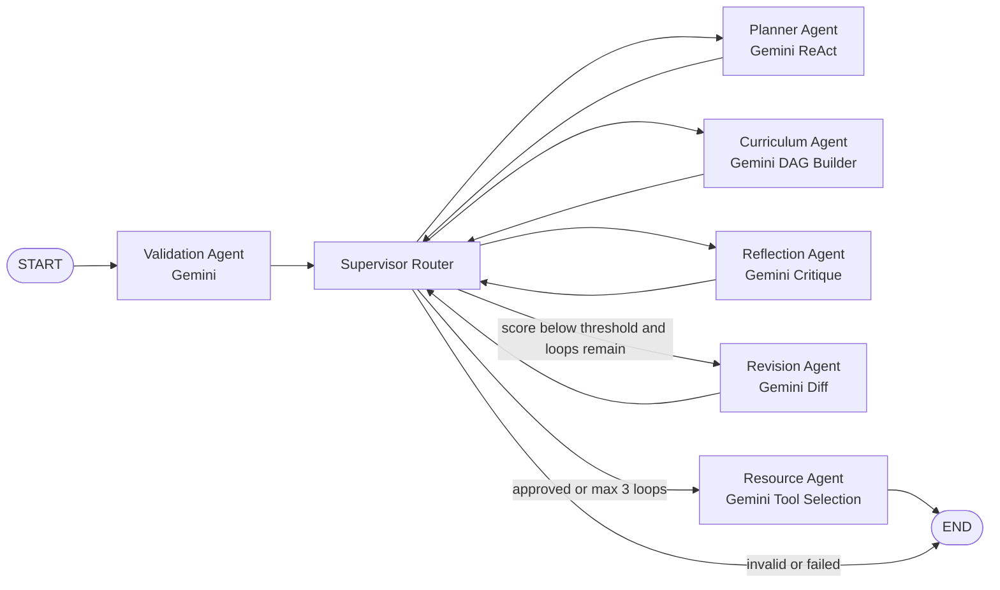

# AI Learning Roadmap Generator Backend

Production-style FastAPI + LangGraph backend for a multi-agent learning roadmap workflow.

## Architecture

The graph now uses a supervisor and specialized workers:



Actual workflow:

`Validation -> Planner(ReAct) -> Curriculum -> Reflection <-> Revision(max 3) -> Resource(Tool Use)`

- `ValidationAgent` uses Gemini routing and can stop execution for invalid requests.
- `PlannerAgent` uses Gemini routing and an iterative ReAct loop. The planner chooses `domain_classifier`, `skill_gap_analysis`, `difficulty_estimator`, `roadmap_template_lookup`, or `Finish`, stores thoughts/actions/observations, and stops within a configurable max step count.
- `CurriculumAgent` uses Gemini routing and produces a DAG validated by `CurriculumValidator`.
- `ReflectionAgent` uses Gemini routing and returns structural, educational, and personalization critiques with strengths, weaknesses, missing topics, dependency issues, scores, and revision instructions.
- `RevisionAgent` uses Gemini routing and consumes reflection instructions to improve nodes, edges, timelines, prerequisites, milestones, and produces a revision diff.
- `ResourceAgent` uses Gemini routing, LLM-driven tool decisions, result quality checks, fallback retries, and real LangChain `StructuredTool`s through `ToolExecutor`.
- `Supervisor` owns routing, reflection-loop decisions, and failure routing.

LangGraph features used:

- `StateGraph`
- typed `RoadmapState`
- conditional edges
- retry policies
- `MemorySaver` checkpointing
- streaming endpoint
- interrupt-ready graph compilation
- structured error-state routing
- execution, tool, provider, and agent traces
- node-level state contracts for inputs and outputs
- reflection history, revision history, score deltas, and workflow improvement summaries

## Setup

```powershell
python -m venv .venv
.\.venv\Scripts\Activate.ps1
python -m pip install --upgrade pip
python -m pip install -r requirements.txt
Copy-Item .env.example .env
uvicorn app.main:app --reload
```

API docs: `http://127.0.0.1:8000/docs`

## Manual Environment Values

Required for live LLM calls:

- `Gemini_API_KEY`: Planner, Curriculum, Revision, and Resource provider route.

Optional:

- `YOUTUBE_API_KEY`: enables YouTube Data API resource search.
- `TAVILY_API_KEY`: enables Tavily web search.
- `LANGSMITH_API_KEY`: enables LangSmith tracing when LangChain environment variables are configured.
- `Gemini_MODEL`: default `llama-3.3-70b-versatile`.
- `USE_LLM=false`: deterministic local agent outputs while preserving provider routing.
- `ENABLE_EXTERNAL_TOOLS=false`: disables external HTTP tools for offline tests.

## Postman Request

Preferred endpoint:

`POST http://127.0.0.1:8000/api/v1/roadmaps`

Compatibility endpoint:

`POST http://127.0.0.1:8000/generate-roadmap`

Operational endpoints:

- `GET /health`
- `GET /metrics`
- `GET /workflow/{request_id}`
- `GET /workflow/{request_id}/debug` when `DEBUG_MODE=true`
- `GET /api/v1/roadmaps/metrics`
- `GET /api/v1/roadmaps/{request_id}`
- `GET /api/v1/roadmaps/{request_id}/debug` when `DEBUG_MODE=true`

## Frontend Response Contract

Roadmap endpoints return only frontend-safe data:

```json
{
  "status": "success",
  "roadmap": {
    "title": "Generative Ai Engineer",
    "nodes": [],
    "edges": [],
    "resources": {}
  },
  "metadata": {
    "iterations": 1,
    "duration_seconds": 0.42,
    "generated_at": "2026-05-31T16:00:00+00:00"
  }
}
```

ReAct traces, provider routing, tool calls, reflection history, execution traces,
and other debugging details stay in LangGraph state and terminal logs. They are
available only from debug endpoints when `DEBUG_MODE=true`.

```json
{
  "goal": "Generative AI Engineer",
  "weekly_hours": 15,
  "deadline_months": 6,
  "experience_level": "Intermediate",
  "experience_description": "I know Python and FastAPI.",
  "interests": "LLMs, agents, backend systems",
  "learning_objectives": ["Build production AI agents"]
}
```

## Verification

```powershell
$env:USE_LLM='false'
$env:ENABLE_EXTERNAL_TOOLS='false'
.\.venv\Scripts\python.exe -m pytest -q
```

Current suite covers provider routing, ReAct planning, DAG validation, reflection-driven revision, tool execution tracing, validation stop behavior, and the API workflow.

## Migration Notes

- Old `/generate-roadmap` still works, but new code should use `/api/v1/roadmaps`.
- Public roadmap responses now include only `status`, `roadmap`, and `metadata`.
- Debug fields such as `request_id`, `execution_id`, `agent_trace`, `tool_trace`, `provider_usage`, `structured_trace`, `reflection_history`, `revision_history`, `tool_reasoning`, `tool_results`, and `improvement_summary` are internal by default.
- Set `DEBUG_MODE=true` to enable `/workflow/{request_id}/debug` and `/api/v1/roadmaps/{request_id}/debug`.
- Reflection reports are no longer part of the public response; use debug endpoints for audit data.
- Resource results are attached to roadmap nodes and summarized in `roadmap.resources`.
